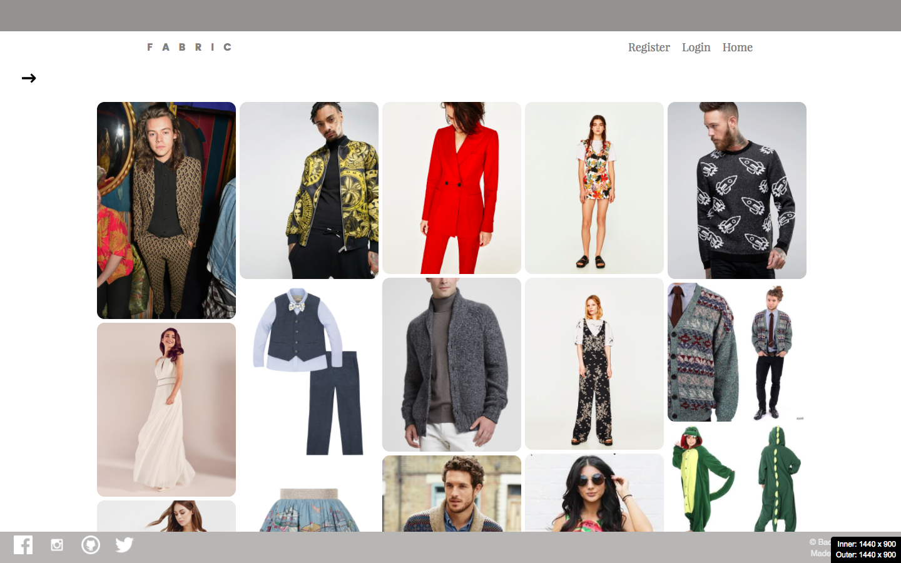
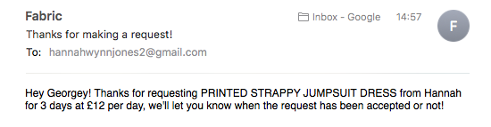
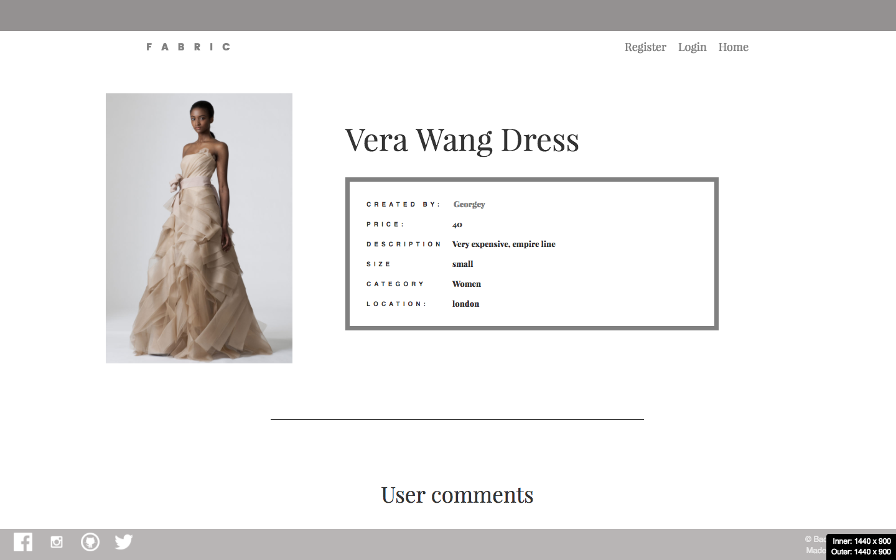
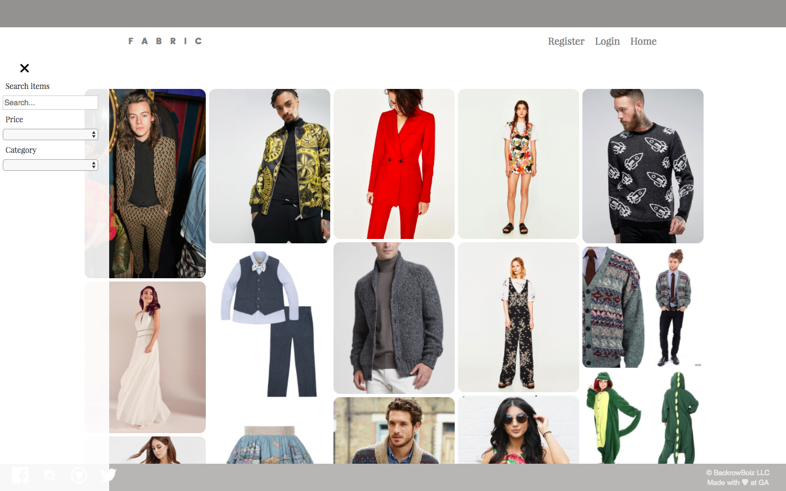
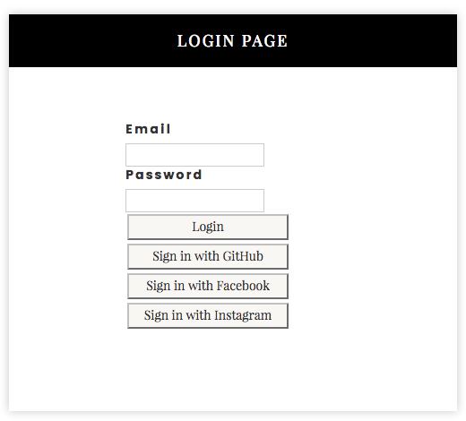
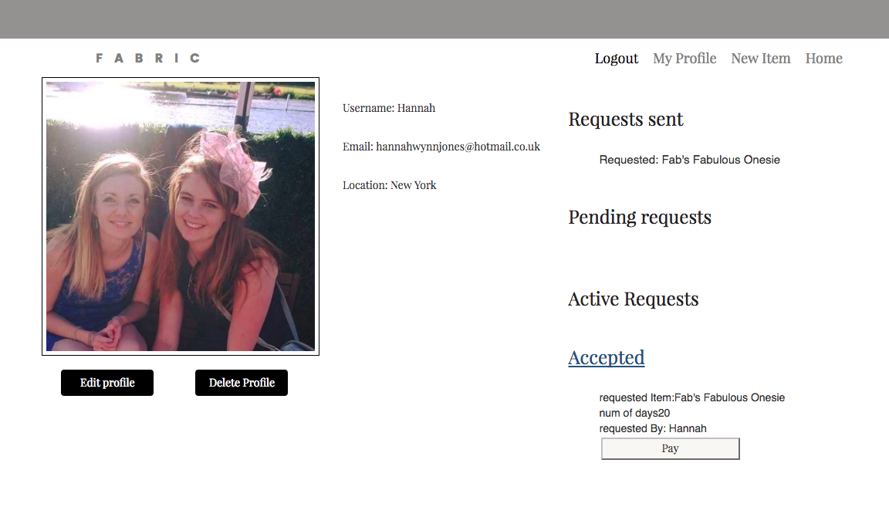
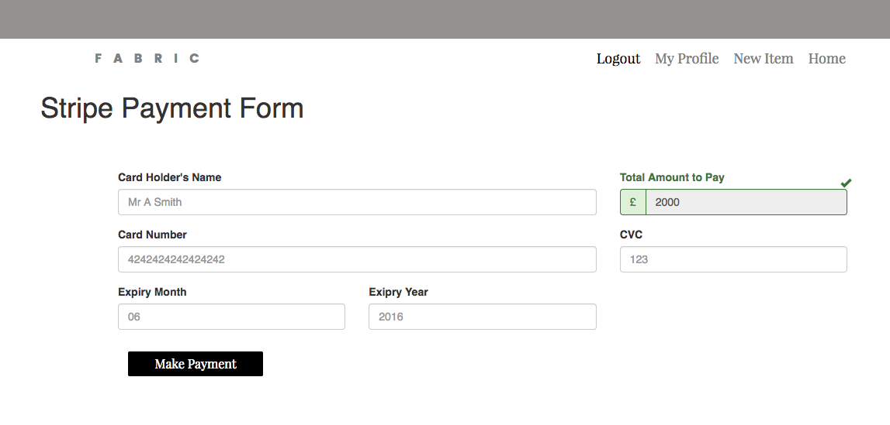
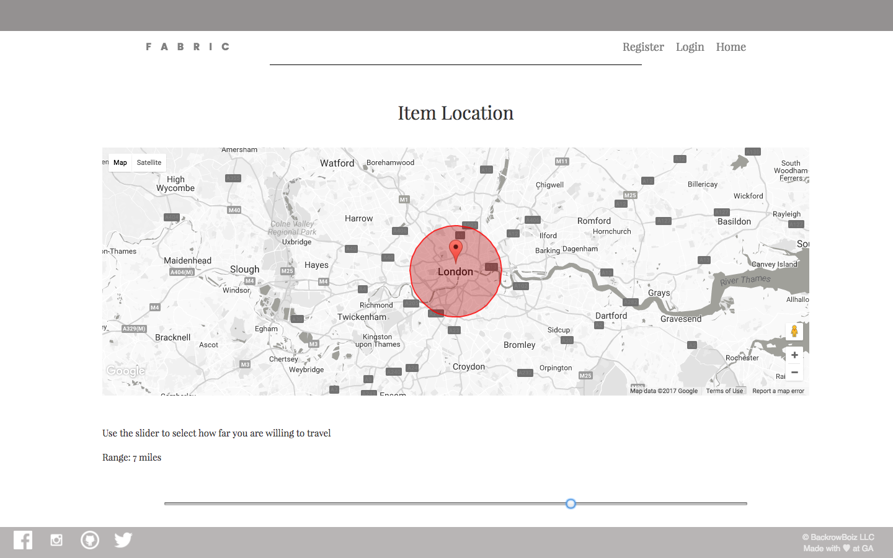
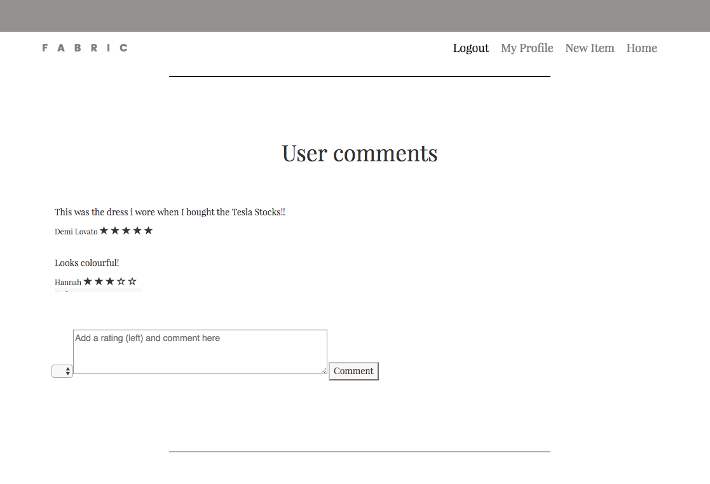

# Fabric
### GA WDI London - Project 3

  

By Sam, Buki, Jake and Hannah

Project link - https://guarded-refuge-81006.herokuapp.com/

**[Gallery](#gallery)**  

#### Approach / How It Works

The idea behind the app was to create a place where users could post items of clothing for other users to rent. A user can them come along and 'request' the item and let the item owner know the number of days they want the item for and can also comment on the item as well. At this point, both the user and the item owner receive different emails confirming the request. The item owner then needs to go to the Fabric website to 'accept' the request. The user then is able to pay for the item using Stripe and another set of emails is sent to both parties once the payment has been made.

Users can login using either an email address, Facebook, Instagram or Github. Users are able to upload images and descriptions of their item that they want to rent and then edit and delete these posts . They're also able to update or delete their profile.

#### The Build

As a team, we started wire framing on the white board and moved those ideas to Balsamiq.  We used Trello to plan the one week sprint.

We began the app by building out the restful routes and pages, then linked it to our database. We split the group and pair-coded the front and the back ends separately.

Once the pages and links worked together, we added the image uploader using AWS to the 'new item' page.

We then added authentication so users would need to be logged into use the app.

Comments feature was added, and conditions so that only the owner of the comment could delete that comment.

We added Facebook, GitHub and Instagram logins using their documentation.

I also added authentication features meaning that (inc getting blogs to edit or not depending on whether it’s your app)

Secure Route. Conditions were also added to the items pages so that blogs could only be edited or deleted by the owners of that blog.

### My Role

In this team project we worked together by pair-coding at the beginning so that we could create the basic CRUD app together.  We then had different parts to focus on.  

For my part I was responsible for the Authentication on the app, both the basic email and username and also the Oauth (Facebook, Instagram and Github).

I also added Nodemailer to the app so that users received emails when they register and when they are the requestor or have their item's requested.

  

The other main part I was responsible for was the styling of the item show page which I aimed to be smart and sophisticated, and also responsive.

  

### Testing

Tests were carried out using Mocha and Supertest which tested both the back ad front end successfully.

### Problems & Challenges

As a team we worked really well as we all played to our strengths and because we pair coded a good proportion, we all understood the dynamics of the app.

Our main issues that arose were from git conflicts especially when styling the app.  We were all in agreement that should we work together, we'd use a structured set of SCSS files rather than one.

Stripe, Map radius and Instagram Oauth proved difficult but they were worth it when they came together.

Websockets would have also been a great addition to the project but was removed as it was taking too much time.

we shall see in the presentation
questionable items uploaded by the public
sometimes the comment for the item pops up in the top corner when you make the request.

### What went well

We found that because we had a strong file structure, it made it easier to spot issues and divide up work.  For example, in our controllers it was easy to de-bug when they were divided which would have been a nightmare if all the item controllers were on the same page.  

As a team we worked really well as we all played to our strengths and because we pair coded a good proportion, we all understood the dynamics of the app.

### Future Changes and Additional features

* websocket
* cleaner styling
* SASS in partials
* postage API? Finding our how much it would cost to send the item.

# Gallery

<h5>Welcome page with search bar open</h5>
 

  

<h5>Login page</h5>
 

  

<h5>User profile page </h5>

This is where users can click on the tabs on the right and see whether they have requests sent, pending, active requests or accepted requests (where they can go through to the stripe payment page)

  

<h5>Stripe payment page</h5>
 

  

<h5>Item location</h5>
 Sliding bar used to show the distance the item is from.  In this picture the red circle show the area that is 7 miles from the item's location.
 

  

<h5>Comments</h5>
Users can add comments and give the item a rating.

  

